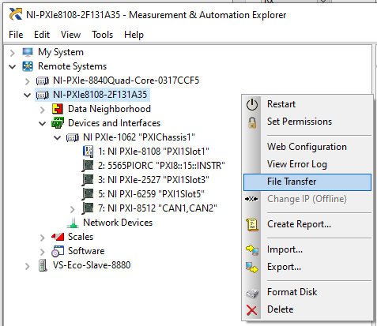
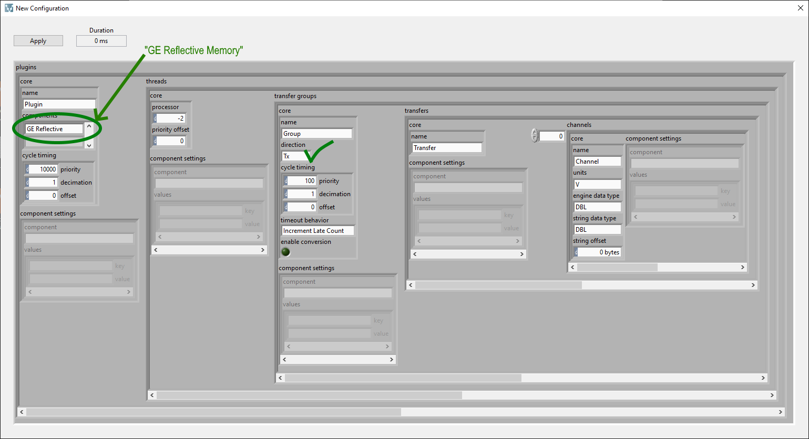
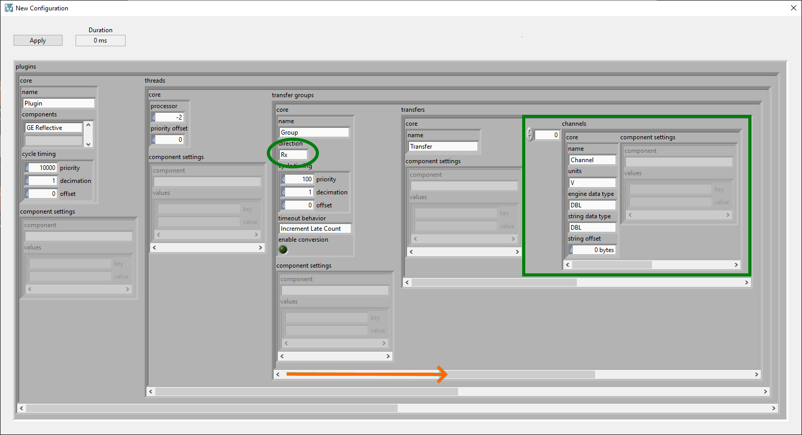
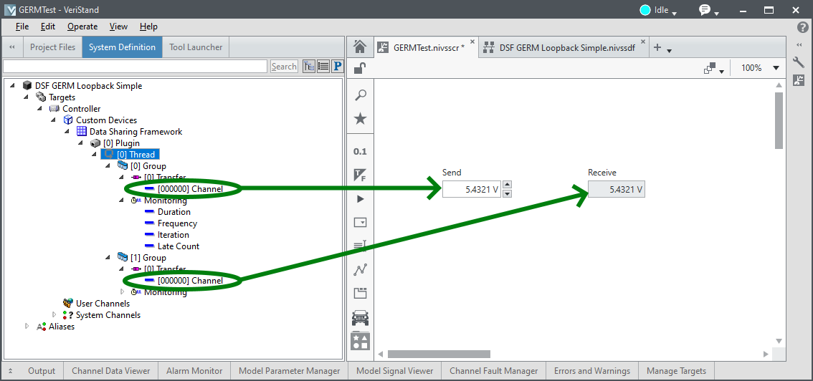
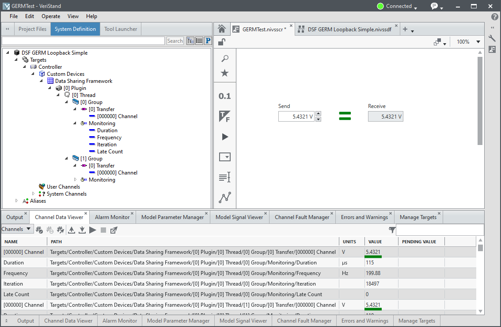

# Getting Started with the GE Reflective Memory Component
The **GE Reflective Memory** plugin component for the Data Sharing Framework custom device implements a point-to-point communication mechanism. This mechanism allows PXI GE Reflective Memory devices (5565PIORC) to share data in a real-time measurement and control system.

Use this document to create a new Data Sharing Framework custom device that leverages the GE Reflective Memory plugin component to perform loopback communications.

## Prerequisites
Before starting this exercise, install the following software:

- VeriStand
- Data Sharing Framework ([DSF Releases](https://github.com/ni/niveristand-data-sharing-framework-custom-device/releases))
- Data Sharing Framework Plugins ([DSF Plugins Releases](https://github.com/ni/niveristand-data-sharing-framework-custom-device-plugins/releases))
- RT driver support for the GE Reflective Memory device
   **Note** The GE Reflective Memory driver for this custom device is incompatible with the GE Fanuc driver installed through NI-MAX. The GE Fanuc driver is used by VeriStand's built-in reflective memory support. You must uninstall the GE Fanuc driver from the RT target before continuing.
   - Locate the `GE5565PIORC_NetworkInterrupts_DMA.inf` file on disk. The `.inf` file is installed by the NI Package for this component and can be found on disk at the file path below:
   ```
   <Public Documents>\National Instruments\NI VeriStand 20xx\Custom Devices\Data Sharing Framework\Windows\Components
   ```
   - Right-click the RT target in NI-MAX and select **File Transfer**. Copy the `.inf` file to the RT target at `c:/ni-rt/system/`. You must reboot the RT target to take effect.

   

## Connect to the Remote System
Identify and connect to the remote system using NI-MAX. Take note of the IP address of the remote system. For this loopback exercise, a GE Reflective Memory device will send and receive data.

## Create a VeriStand Project
1. Open VeriStand
1. Create a New Project
1. Open *System Explorer*
1. Under `<Project>/Targets`
   - Select 'Controller'
      - Verify **Operating System** = *Windows*
      - Verify **IP Address** = *localhost*
      - Note **Target Rate** = 100 Hz
1. Under `<Project>/Targets/Controller/Hardware`, right-click **Custom Devices** and select **Data Sharing Framework**
*Note*: You can only deploy one instance of the Data Sharing Framework custom device per target.

## Configure the Custom Device
1. Select the newly created Data Sharing Framework custom device
1. Click **New** to launch a dialog box to manually configure the custom device by setting the values in the DSF configuration cluster.
   - Enter *GE Reflective Memory* in the first element of the components array
      - **Thread(0).transfer groups(0)**
         - Verify **core.direction** = *Tx*
         - Note that the channels array is configured to include a single numeric element
            - **engine data type** = *DBL* and should not be changed.
            - **string data type**= *DBL* and may be set to any datatype wide enough to hold the data value to transfer
            

       - **Thread(0).transfer groups(1)** _(Navigate to index 1 using the horizontal scrollbar for the threads array)_
          - Verify **core.direction** = *Rx*
         - Note that the channels array is configured to include a single numeric element
            - **engine data type** = *DBL* and should not be changed.
            - **string data type** = *DBL* and should be configured exactly the same as the Tx transfer.
            

    - Click **Apply** to save your new configuration
    - Close the dialog box
1. In the configuration tree, under [0] Plugin, select **[0] Thread** to open the configuration page:
   - In Components listbox, select **GE Reflective Memory**
   - Set VISA Resource to the VISA Resource Name
   **Note** You can find the Visa Resource Name in NI-MAX by selecting the GE Reflective Memory Card
1. Save the system definition
1. Close *System Explorer*
1. Add a new screen to the VeriStand project
1. Expand the system definition tree and add the VeriStand channels for the configured transfers

1. Deploy the project
1. Once Connected, verify that changing the send transfer channel value updates the receive transfer channel value

