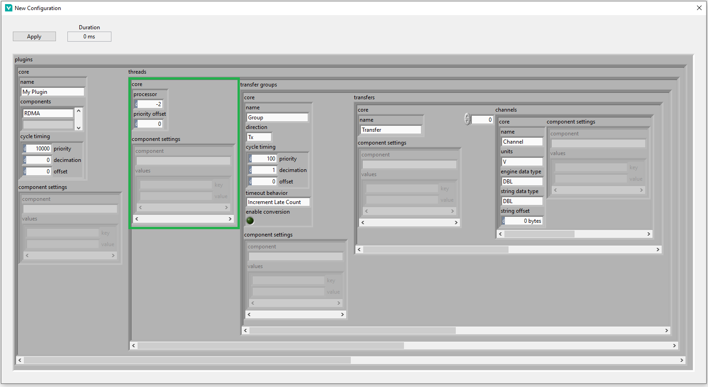

# Getting Started with the RDMA Component
The **RDMA** plugin component for the Data Sharing Framework custom device implements a point-to-point communication mechanism that enables high-throughput, low-latency data transmission between HIL targets running in parallel. This mechanism allows nodes in a real-time measurement and control system to share VeriStand Channel Data.

Use this document to create a new Data Sharing Framework custom device that leverages the RDMA plugin component to transmit data between HIL targets or perform an RDMA loopback test.

This tutorial assumes general knowledge of RDMA technology and your familiarity with NI software such as NI-MAX and NI-VeriStand.

## Prerequisites

### Required software:
- [VeriStand](https://www.ni.com/en-us/support/downloads/software-products/download.veristand.html#442755) (2020 or later)
- [NI-RDMA](https://www.ni.com/en-us/support/downloads/drivers/download.ni-rdma.html#442618) 21.5 or later
- Data Sharing Framework [Custom Device](https://github.com/ni/niveristand-data-sharing-framework-custom-device/releases/tag/v20.4.0)
- Data Sharing Framework [Plugins](https://github.com/ni/niveristand-data-sharing-framework-custom-device-plugins/releases)

### Required Hardware:
- NI-RDMA supported hardware (NI PXIe-8280 or NI PXIe-8285)

## Hardware setup

Before proceeding any further in this tutorial, ensure that the RDMA interfaces that will be used are physically connected to each other.

**Note:** Performing loopbacks across multiple RDMA interfaces belonging to modules of a single target is NOT supported. Attempting this will result in VeriStand errors. If you are interested in performing a loopback test while following this tutorial you must physically connect two RDMA interfaces (so that the RDMA interfaces will be assigned IP addresses), then perform an internal loopback test on a single RDMA interface.

## Connect to and Identify Hardware in NI-MAX

- ### Install NI-RDMA on the target
   Identify and connect to the remote system containing the supported RDMA hardware in NI-MAX. Use the "Add/Remove Software" dialog to install NI-RDMA onto each target. **Note:** Ensure that the programming environment is set to LabVIEW and that the version of LabVIEW matches the verstion of VeriStand you are using. For example: if using VeriStand 2020, then use LabVIEW 2020 as the programming environment.

- ### Identify Hardware by IP Address
   View the "System Settings" tab for each target you will be using in this tutorial. If you have connected the hardware correctly, there should be multiple IP Addresses listed under the "IP Address" section. The first IP address is the LAN address tied to the Linux Target's NIC. The subsequent IP addresses in the list are the address(es) assigned to the RDMA module(s). Take note of these addresses, as we will need them to configure the RMDA DSF plugin.

   

   For the purposes of this tutorial, we will be using 169.254.198.135 for the TX end and 169.254.147.43 for the RX side.


## Create a VeriStand Project
1. Open VeriStand.
1. Create a New Project.
1. Open *System Explorer*.
1. Add and configure your target(s) containing RDMA Hardware, being sure to verify the following fields:
      - **Operating System** = *Linux_x64*
      - **IP Address** = IP Address or Hostname of the Linux target (not the RDMA address)
      - **Target Rate** = 100 Hz
1. Under `<Project>/Targets/Controller/Hardware`, right-click **Custom Devices** and select **Data Sharing Framework**. **Note:** You can only deploy one instance of the Data Sharing Framework custom device per target.

## Configure the Custom Device
On the page for the newly added Data Sharing Framework Custom Device, click **New** to launch a dialog box to configure the custom device by setting the values in the DSF configuration cluster. Configure as follows:

1. ### Configure the Plugin-level settings
   Purpose: Configure the top-level settings (specifically, timing) for each plugin. For the purposes of this tutorial, there is only one plugin to configure: RDMA. Configure the first element of the `plugins` array as follows:
   - `name`: Set this value to specify how the plugin will appear in the System Explorer. It does not matter what you choose to use for this field, as long as it is not empty.
   - `components`: Set the first element to be "RDMA"
   - `cycle timing`: Set the decimation to 0 to ensure that the plugin runs inline with the PCL. For more information about priority and offset, see the [DSF Theory of Operation](https://github.com/ni/niveristand-data-sharing-framework-custom-device/blob/main/Docs/Data%20Sharing%20Framework/Theory%20of%20Operations.md).
   - `component settings`: (Optional) You can configure a timeout for the initialization of the RDMA sessions. This is useful when managing several RT targets with multiple transfers per each device. If left blank, the default timeout is **30** seconds. You can change by setting the following:
      - `component`: "RDMA"
      - `values`:
         - element 0
            - `key`: "initialization timeout"
            - `value`: value in seconds
   
   
1. ### DSF Threads
   The RDMA plugin does not currently support multi-threaded configurations. Edit the plugin configuration to have your desired number of sessions in one thread.
   
   For more information on threads, see the [DSF Theory of Operation](https://github.com/ni/niveristand-data-sharing-framework-custom-device/blob/main/Docs/Data%20Sharing%20Framework/Theory%20of%20Operations.md).
   
   
1. ### Configure the Transfer Groups
   Purpose: Transfer Groups are responsible for grouping transfers that should be executed with the same `cycle timing` values, while adding information on the direction (TX or RX) of the transfers. 
   
   We will need to create two transfer groups: one for the TX endpoint, and one for the RX endpoint. Each transfer group will be represented by a single element in the `transfer groups` array.   
   
   **Note:** If you are not doing a loopback test, then you only need to configure the transfer groups associated with the target that you are currently configuring. The other endpoint(s) will be configured under their respective targets.

   Configure each transfer group as follows:
   - `core.name`: Use this to specify how the transfer group will appear in the System Definition.
   - `core.direction`: Specifies whether the transfer(s) in this group will be TX or RX.
   - `core.cycle timing`:  Configure how you wish, or use the values depicted below. Remember, a decimation of 0 puts the transfer group in line with the PCL. For more information on cycle timing, see the [DSF Theory of Operation](https://github.com/ni/niveristand-data-sharing-framework-custom-device/blob/main/Docs/Data%20Sharing%20Framework/Theory%20of%20Operations.md). 
   - `core.timeout behavior`: Choose whatever you prefer, as it should not impact your success in following this tutorial.
   - `core.enable conversion`: Choose whatever you prefer, just be sure that corresponding enpoints have the same setting for this field.
   - `component settings`: Leave empty, as there are no component settings for RDMA transfer groups.

      **Note:** The effective timing for each end of a data transfer must be equal to ensure deterministic data transfer. The effective timing can be calculated as follows:

      ```

      [Effective Timing] = [Target PCL Rate] / ([DSF Custom Device Decimation] * [DSF Plugin Decimation] * [DSF Transfer Group Decimation])

      ```

      If TX and RX endpoints are configured with differing effective timings, then the transfer group late count monitoring channel (located under each transfer group) on the endpoint effectively running faster will begin ticking up upon deployment.
   
      
1. ### Configure the Transfers in Each Transfer Group
   Purpose: Transfers represents a single block of channel data to be transmitted or received. Transfers are composed of one or multiple channels. For the purpose of RDMA, a single transfer contains the data for all the channels that are updated using a single RDMA buffer (**Note:** this is different from DSF buffers). For more information on transfers, see the [DSF Theory of Operation](https://github.com/ni/niveristand-data-sharing-framework-custom-device/blob/main/Docs/Data%20Sharing%20Framework/Theory%20of%20Operations.md). 

   Configure each transfer as follows:
      - `core.name`: Use to specify how the transfer will be labeled in the System Definition
      - `component settings`:
         - `component`: "RDMA"
         - `values`:
            - element 0
               - `key`: "local address"
               - `value`: enter the IP address of the RDMA module that was denoted earlier ("local" means the IP address of the module being used for this transfer)
            - element 1
               - `key`: "local port"
               - `value`: choose an available local port
            - element 2 (only required for transfers in TX transfer groups)
               - `key`: "destination address"
               - `value`: enter the IP address of the RDMA module being used as the RX endpoint
            - element 3 (only required for transfers in TX transfer groups)
               - `key`: "destination port"
               - `value`: choose an available destination port at the address specified by "destination address" (not required for transfers within an RX transfer group)
      
      
      
1. ### Configure the Channels
   - There is no special configuration needed for the channels. You may configure them however you wish, with a few constraints:
      - You may add as many channels per transfer as you would like. Just keep in mind that each endpoint for a given connection must have the same number of channels. For the purposes of this tutorial, we recommend a single channel per transfer. **Note:** `channels`[n] in the RX transfer is sent from `channels`[n] in the corresponding TX transfer.
      - Make sure that the `engine data type` and `string data type` match between each endpoint. 
   - There are no `component settings` for RDMA channels, so leave that field blank.
   For more information on DSF channel configurations, see the [DSF Theory of Operation](https://github.com/ni/niveristand-data-sharing-framework-custom-device/blob/main/Docs/Data%20Sharing%20Framework/Theory%20of%20Operations.md).
   
1. ### Wrap up the configuration
   - Double check that all of the values you entered are correct, because once you apply the settings, you will not be able to return to this cluster to modify the configuration.
   - Click "Apply" to add this configuration to the VeriStand System Definition, and close the dialog box.
   **Note:** While the number of transfer groups, transfers, channels, etc. is fixed, you may still modify the configuration of each node in the System Definition by using the VeriStand System Definition
1. ### Export your configuration (optional, but strongly recommended)
   Click the `Export...` button on the Data Sharing Framework custom device page to export a JSON representation of the configuration that you just created. This will enable you to quickly configure similar DSF custom devices or quickly modify the existing configuration by editing the JSON then using the `Import...` feature.
   
   **NOTE:** If you'd like to quickly configure the plugin without interacting with the DSF configuration cluster, there exists a TX and RX example configuration file in this directory. Modify the fields to match your setup and use the `Import...` feature.
   
   
1. ### Repeat DSF Configuration for each target in your System Definition 
1. ### Save and Close the VeriStand System Definition Explorer

## Deploy
   - The Veristand Project should now be ready for deployment. Ensure that you have a good connection to all the target(s) in your system, and deploy.
   - You should now be able to create a Screen in your VeriStand project and drop the channels that you just configured onto that screen.
