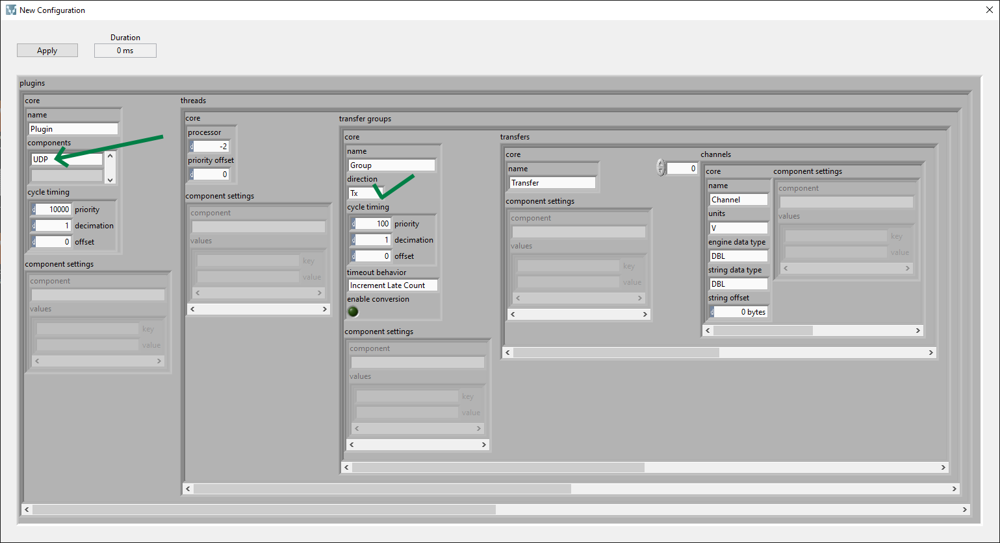
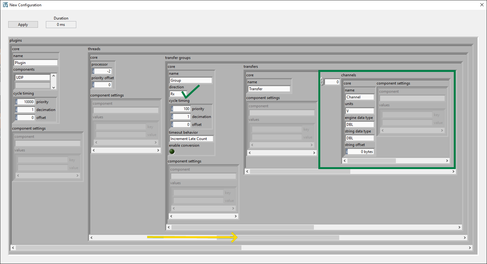
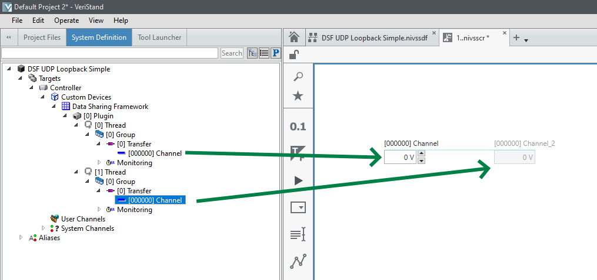
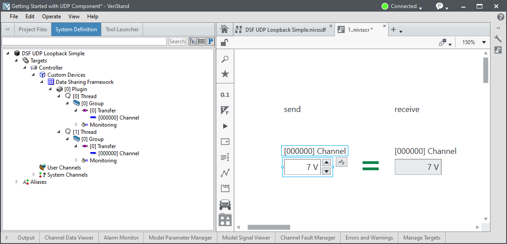

# Getting Started with the UDP Component
The **UDP** plugin component for the Data Sharing Framework custom device implements a point-to-point communication mechanism. This mechanism allows nodes in a real-time measurement and control system to share datagrams.

Use this document to create a new Data Sharing Framework custom device that leverages the UDP plugin component to perform loopback communications.

## Prerequisites
Before you begin, install the following software:
- VeriStand
- Data Sharing Framework ([DSF Releases](https://github.com/ni/niveristand-data-sharing-framework-custom-device-plugins/releases))

## Connect to the Remote System
Identify and connect to the remote system using NI-MAX. Take note of the remote system's IP address. For this loopback exercise, the host system ('localhost') will send and receive data.

## Create a VeriStand Project
1. Open VeriStand
1. Create a New Project
1. Open *System Explorer*
1. Under `<Project>/Targets`
   - Select **Controller**
      - Verify **Operating System** = *Windows*
      - Verify **IP Address** = *localhost*
      - Note **Target Rate** = 100 Hz
1. Under `<Project>/Targets/Controller/Hardware`, right-click **Custom Devices** and select **Data Sharing Framework**
**Note**: You can only deploy one instance of the Data Sharing Framework custom device per target.

## Configure the Custom Device
1. Select the newly created Data Sharing Framework custom device
1. Click **New** to launch a dialog box to configure the custom device by setting the values in the DSF configuration cluster.
   - Enter *UDP* in the first element of the components array
      - **Thread(0)**
         - Verify **transfer groups(0).core.direction** = *Tx*
         - Note that the channels array is configured to include a single numeric element
            - **engine data type** = *DBL* and should not be changed
            - **string data type**= *DBL* and may be set to any datatype wide enough to hold the data value to transfer
            

       - **Thread(1)** _(Navigate to index 1 using the horizontal scrollbar for the threads array)_
          - Verify **transfer groups(0).core.direction** = *Rx*
         - Note that the channels array is configured to include a single numeric element
            - **engine data type** = *DBL* and should not be changed
            - **string data type** = *DBL* and should be configured similarly to the Tx transfer
            

    - Click **Apply** to save your new configuration
    - Close the dialog box
1. In the configuration tree, under [0] Plugin, select **[0] Thread** to open the configuration page:
   - In the Components listbox, select **UDP**.
   - Set the Local Address to *localhost*, which is automatically set to 127.0.0.1
   - Set the Local Port to the data sending port (i.e. '50000')
   - Under [0] Group, select **[0] Transfer**
      - Set the Destination Address to *localhost*
      **Note** Generally, this would be set to the transfer destination address.
      - Set the Destination Port to the transfer port (i.e. '50001')
1. Under [0] Plugin, select **[1] Thread**. In the configuration page:
   - Select **UDP** in Components listbox
   - Set **Local Address** to *localhost* which is automatically set to 127.0.0.1
   - Set **Local Port** to the port (i.e. '50001') that data will be read from.
   **Note** This port must match the Destination Port.
   - Under [0] Group, select **[0] Transfer**
      - Set the Source Address to *localhost* (generally, this would be set to the address of the transfer source)
      - Set the Source Port to the port (i.e. '50000') that the transfer originates from
      **Note** This port must match the Local Port value specified for [0] Thread.
1. Save the system definition
1. Close *System Explorer*
1. Add a new screen to the VeriStand project
1. Expand the system definition tree and add the VeriStand channels for the configured transfers

1. Deploy the project
1. Once Connected, verify that changing the send transfer channel value updates the receive transfer channel value

