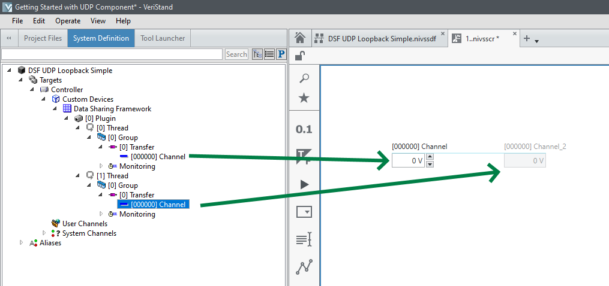

# Getting Started with the UDP Component
The UDP plugin component for the Data Sharing Framework Custom Device for VeriStand implements a point-to-point communication mechanism that allows sharing of datagrams between nodes in a real-time measurement and control system. 

Use this document to create a new data sharing framework custom device that leverages the UDP plugin component to perform a simple loopback communication.

## Prerequisites
Before starting this exercise, install the following software:
- VeriStand
- Data Sharing Framework ([DSF Releases](https://github.com/ni/niveristand-data-sharing-framework-custom-device-plugins/releases))

## Connect to the Remote System
Identify and connect to the remote system using NI-MAX. Take note of the IP address of the remote system. For this loopback exercise, the host system ('localhost') will both send and receive data.

## Create a VeriStand Project
1. Open VeriStand
1. Create a New Project
1. Open the System Explorer
1. Under `<Project>/Targets`
   - Select 'Controller'
      - Verify **Operating System** = 'Windows'
      - Verify **IP Address** = 'localhost'
      - Note **Target Rate** = 100 Hz
1. Under `<Project>/Targets/Controller/Hardware, right click on 'Custom Devices'`
   - Select 'Data Sharing Framework' from the popup menu

*Note*: Only one instance of the Data Sharing Framework Custom Device can be deployed per target.

## Configure the Custom Device
1. Select the newly created 'Data Sharing Framework' Custom Device
1. Because we are starting from scratch, select **New...** which launches a dialog that enables you to manually configure the custom device by directly setting the values in the DSF configuration cluster.
   - Enter "UDP" in the first element of the components array
      - **Thread(0)**
         - Verify **transfer groups(0).core.direction** = "Tx"
         - Note that the channels array is configured to include a single numeric element
            - **engine data type** = "DBL" and should not be changed.
            - **string data type**= "DBL" and may be set to any datatype wide enough to hold the data value to transfer
            

       - **Thread(1)** _(Navigate to index 1 using the horizontal scrollbar for the **threads** array)_
          - Verify **transfer groups(0).core.direction** = "Rx"
         - Note that the channels array is configured to include a single numeric element
            - **engine data type** = "DBL" and should not be changed.
            - **string data type** = "DBL" and should be configured exactly the same as the 'Tx' transfer.
            
            
    - Press **Apply** to save your new configuration
    - Close the dialog
1. In the configuration tree, under "[0] Plugin", select "[0] Thread". In the configuration page:
   - Select "UDP" in **Components** listbox
   - Set **Local Address** to "localhost" which is automatically set to 127.0.0.1
   - Set **Local Port** to the port (i.e. '50000') that data will be sent from
   - Under "[0] Group", select "[0] Transfer"
      - Set the **Destination Address** to "localhost" (generally, this would be set to the address of the transfer destination)
      - Set the **Destination Port** to the port (i.e. '50001') that the transfer is sent to
1. Under "[0] Plugin", select "[1] Thread". In the configuration page:
   - Select "UDP" in **Components** listbox
   - Set **Local Address** to "localhost" which is automatically set to 127.0.0.1
   - Set **Local Port** to the port (i.e. '50001') that data will be read from. (This must match the **Destination Port** above)
   - Under "[0] Group", select "[0] Transfer"
      - Set the **Source Address** to "localhost" (generally, this would be set to the address of the transfer source)
      - Set the **Source Port** to the port (i.e. '50000') that the transfer originates from (This must match the **Local Port** value specified for **[0] Thread**)
1. Save the System Definition
1. Close the System Explorer
1. Add a new 'Screen'
1. Expand the System Definition tree and add the VeriStand channels for the configured transfers

1. Deploy the project
1. Once Connected, verify that changing the value of the *send* transfer channel value updates the value of the *receive* transfer channel value

