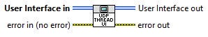
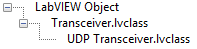

Overview
========

This tutorial walks through the design and implementation of a UDP Transceiver component for the Data Sharing Framework.

Requirements
============

This section covers the design requirements that drive the implementation of the UDP component.

- Bind to 1 or more local ports for Rx and Tx transfers.
- Each local port handled by a dedicated thread.

Required Settings
-----------------

The **plugin configuration** is a single cluster that captures all aspects of configuration for the components that the plugin will execute.

### Plugin Settings

No UDP settings required at the plugin level. While there are no required UDP settings, you must configure the components that will be used by the DSF plugin. The specified component must match the name of the installed plugin packed project library (without file extension). For the UDP plugin for DSF, the UDP.lvlibp library is installed, so you should specify "UDP" in the **components** array.

### Thread Settings

DSF plugins launch a thread for every element in the threads array of the plugin configuration. To have UDP bind one port per thread, the desired port number is configured as a setting in the plugin's **threads** array.

1. **Local Port** - Which local port the thread should bind to.
2. **Local Address** - Which IP address (for multiple NICs) to interface with.

### Transfer Group Settings

No UDP settings required at the Group level.

### Transfer Settings

A Transfer is analogous to an individual UDP datagram, either being sent or received. As such, there are some settings that will be required at runtime:

1. Tx only
    1. **Destination Address** - IP address of the datagram destination.
    2. **Destination Port** - Which port of the destination to send the datagram to.
2. Rx only
    1. **Source Address** - The address where the datagram is expected to be received from.
    2. **Source Port** - The port where the datagram is expected to be received from.

### Channel Settings

No UDP settings required at the Channel level.

Implementation
==============

Project Creation
----------------

1. Create a LabVIEW project for your component(s).

**Note**: It is recommended that you create two projects: Development and Build. Because this framework uses classes, they will not be editable when loaded under multiple target contexts. Use the Build project to include all your supported target types, which will lock the classes, and the Development project with just 'My Computer' to allow the classes to be edited.

2. Add a LabVIEW library to the project. This is the library that will be built into the components packed project library (PPL), and the name of this library will be the name of your component.

3. Add DSF Core.lvlibp to the project.

**Note**: There is a different Framework PPL for each target type supported by the Framework, since PPLs are binaries built against specific runtimes and CPU architectures. To ensure component classes do not break when building for different target types, the name of the core Framework Core PPL is always 'DSF Core.lvlibp' to ensure class inheritance does not break across all targets. When building for multiple target types, the DSF Core PPL must be swapped out on disk for each target type you build for. Because of this, it is recommended to use the Windows version of the DSF Core PPL in the Development project for your component, and then use the Build project for PPL swapping and building for each target type.

4. Add classes to your library for each of the component classes you would like to override and configure them to inherit from the corresponding classes within the DSF Core PPL.

5. Create a Packed Library Build Specification for your component's library.

Configuration
-------------

For each of the layers (Channel, Transfer, Group, etc.) in the plugin settings cluster that require custom settings for your Component, a class needs to be implemented that inherits from the base **Configuration** class that is available in the DSF Core library. Below is a view of what the final class structure will look like for this UDP implementation:

To create a configuration class, simply create a new class in the project and set it to inherit from the base Configuration class.

The Configuration class provides a few overridable methods that need to be implemented to allow the new configuration class to convert to and from the format used by the DSF configuration file. Below are the current overridable methods:

1. _Finalize to Settings_ - Converts the private data of the class to an array of string key/value pairs for writing to a configuration file.
2. _Initialize from Settings_ - Converts the provided string key/value pairs into runtime data that is stored within the class private data.
3. _Get Data Variant_ (not required) - Returns the current configuration data in variant form. This is optional and is used to view configuration data in a Variant Attribute Tree.
4. _Get Data Version_ (not required) - Returns a version cluster for identifying the format of the data.
5. _Initialize Default_ (not required) - Sets the class private data to a known initial state.

**Example:** UDP Thread Configuration.lvclass

**UDP Thread Configuration.lvclass:Finalize to Settings.vi**

**UDP Thread Configuration.lvclass:Initialize from Settings.vi**

### Component Configurations

The DSF uses another class, called Component Configurations, to dynamically return the each of the above Configuration classes for a given Component. This class provides overridable _Get_ methods that allow the above classes to be individually returned. To create this class, add a new class to the library and set it to inherit from the Component Configurations class:

For each of the Configuration classes previously created, override the corresponding _Get_ method, and return that class as the output. Below is an example for the _Get Thread Configuration_ method.

**UDP Configurations.lvclass**:**Get Thread Configuration.vi**

**Note**: You only need to override the methods for which you have created a custom class to use.

User Interface
--------------

The DSF allows a component to provide a User Interface class that can dynamically be displayed to a user for configuration (in VeriStand, for example). Like the **Configuration** classes, add a new class to the project and set it to inherit from the base **User Interface** class for each **Configuration** class that was created.

There are a few methods to override for each of the UI classes created:

1. _Initialize_ - Gets the UI ready to run. This method is required and requires calling the parent method to create the user events required for communicating with the UI once it is running.
2. _Get User Interface VI_ - Returns a static VI ref for the VI that will be display to the user (more details below).
3. _Destroy_ (not required) - An optional method that is called when shutting down the UI. Can be used to destroy/deallocate items created in the _Initialize_ method.

**Example**: **UDP Thread User Interface.lvclass**

**UDP Thread User Interface.lvclass:Initialize.vi**

The _Initialize_ method calls the parent _Initialize_ method, and then sets the specific **Configuration** class that will be used by this user interface implementation. In the case of the Thread UI, the **Thread Configuration** class is specified, as shown above. The DSF will automatically call the **Configuration** class's **Initialize** from _Settings_ method before displaying the UI to ensure that valid configuration data is present in this class.

The DSF can asynchronously launch user interface VIs that adhere to the following VI connector pane format. The base **User Interface** class is passed in and out of the VI, along with errors.

Exploring the block diagram (shown below), this VI does the following:

1. Use the base **User Interface** class's _Get Stop Event_ method to get the 'Stop' user event, and then registers the event locally.
2. Uses the _Get Configuration_ method to return the Configuration object associated with this User Interface class.
3. Initializes the UI by pulling relevant data out of the **Configuration** object.
4. Handles user events as necessary to update the **Configuration** object until the 'Stop' user event is triggered.
5. Updates the **Configuration** object in the **User Interface** class using the _Set Configuration_ method, and then exits.

Once the above VI is created, the _Get User Interface VI_ is the overridable method that is used to provide a reference to this VI. This is how the DSF knows which VI is meant to be displayed. Simply create a static VI reference, like below:

**UDP Thread User Interface.lvclass:Get User Interface VI.vi**

### Component User Interfaces

Like the **Component Configurations** class, there is a class used by the DSF for returning each of the **User Interfaces** class implementations using a dedicated _Get_ method. Like before, create a new class and set it to inherit from the **Component User Interfaces** class.

Then, for each custom **User Interface** class created above, override the corresponding _Get_ method and return the appropriate class:

**UDP User Interfaces.lvclass:Get Thread UI.vi**

**Note**: You only need to override the methods for which you have created a custom class to use.

Transceiver
-----------

This class is where the runtime UDP functionality for sending and receiving data will be implemented. As before, add a new class and set it to inherit from the **Transceiver** class in DSF Core.

The **Transceiver** class provides the following methods to override:

### Execution

At runtime, one Transceiver instance is created per plugin thread. Once started, the Read and Write states will be called continuously.

1. _Initialize_ - Executes when the parent thread is first created.
2. _Start_ - Executes when the parent thread enters the run state.
3. _Receive_ - Executes on an active read cycle for the parent thread.
4. _Transmit_ - Executes on an active write cycle for the parent thread.
5. _Shutdown_ - Executes when the parent thread is shut down.

### Implementation

To create the UDP Transceiver implementation, methods from classes within the DSF Core PPL will need to be used. The Core PPL exposes several public classes, such as **Transfer** and **Transfer Group**, which themselves have public methods.

#### **Initialize**

The _Initialize_ method is provided by the plugin's **Configuration** object, the ID (index) of the thread, and the name of the Component. Both the ID and Component names are used to pull out settings that are configured for this thread instance. Some Components have settings at the plugin level, which are settings that are shared among all threads created for the plugin, but in many cases the thread ID will be used to retrieve only settings for the thread itself. This **plugin configuration** object contains all the configuration data for the plugin, so the component name is used to filter specific settings.

**UDP Transceiver.lvclass:Initialize.vi**

The initialize VI uses the **Plugin Configuration** class's _Get Thread Configuration_ method to get the **Thread Configuration** object, which then uses its _Get Group Configurations_ method to get all the **Group Configuration** objects for the thread. These configuration objects are passed to the **Initialize Thread** and **Initialize Transfer Groups** subVIs, respectively. These subVIs use methods from the [UDP Configuration](#_Configuration) classes to pull out the data required to initialize the local UDP port, as well as create runtime data for the UDP datagrams corresponding to the **Transfers** within each **Group**.

**UDP Transceiver.lvclass:Initialize Thread.vi**

**Initialize Thread** uses the **Core Configuration** class's _Get Component Settings by Name_ method, along with the Component name string, to initialize the **UDP Thread Configuration** object using its _Initialize from Settings_ method. Accessors from the **UDP Configuration** classes can then be used to retrieve the local port and net address for the thread. The **Initialize Transfer Groups** VI also uses the same approach but initializes data for the Groups and Transfers that will be sent and received by this thread.

#### **Start**

UDP does not implement the _Start_ method.

#### **Receive**

The _Receive_ method receives one datagram for each Transfer in the provided Transfer Group. The **Transfer Group** object that is provided to this method is identified with an integer ID that corresponds to the index from the original Group Configurations array that was used in the [Initialize](#_Initialize) method to create the runtime data for each Group. Use the **Transfer Group** class's _Get ID_ method to get this index. The array of **Transfer** objects contained within this Group can also be retrieved using the **Transfer Group** class's **Get Transfers** accessor, shown in the code below.

In the case of receiving UDP datagrams, the order in which they are received may not match the order that the Transfers are defined in the Transfer Group, due to how UDP as a protocol does not guarantee message ordering. As such, this method receives a number of datagrams equal to the number of Transfers in the Group, and then uses the source IP address and port of the incoming datagram to identify which of the Transfers's Buffers should be updated using the datagram payload. Alternatively, for custom UDP implementations, other information in the datagram, such as header information, can be used to identify which Transfer should be updated.

**UDP Transceiver.lvclass:Receive.vi**

The Transfer Group ID is passed to the **Receive Datagram** subVI, shown below, which is used to pull out parameters specific to that Group from the Transceiver class. A datagram is then read from the local port and parsed to determine which Transfer needs to be updated, which is returned as the Transfer ID (index). This ID is used to index the Transfers array, shown above, and the indexed Transfer object is passed to the Write Transfer Buffer subVI.

**UDP Transceiver.lvclass:Receive Datagram.vi**

The **Write Transfer Buffer** subVI, shown below, uses the **Transfer** class's _Get Active Buffer_ method to get the **Buffer** object that will be updated. The _Get Active Buffer_ method returns either the Engine or String Buffer, and which is returned is determined by the Core Configuration for the Transfer Group. In this Configuration, the user can choose to 'enable conversion' for the Transfer Group. This tells the Framework to convert the Group's channel data from the engine representation to the string representation for Transmit operations, or vice versa for Receive operations, using the Buffer Converter class. The size of the received data is checked to ensure that it matches the allocated size of the Buffer before writing the data using the **Buffer** class's _Write_ method.

**Transfer.lvclass**:**Get Active Buffer.vi**

**UDP Transceiver.lvclass**:**Write Transfer Buffer.vi**

#### **Transmit**

The _Transmit_ method implementation is similar to the _Receive_ method but reversed. The Transfers within the Group are iterated through, and for each transfer, the buffer data is read and provided to the Transmit Datagram subVI.

**UDP Transceiver.lvclass:Transmit.vi**

#### **Shutdown**

The _Shutdown_ method closes the active connection ID and clears the class data.

**UDP Transceiver.lvclass**:**Shutdown.vi**

Build
-----

1. Replace the DSF Core PPL, on disk where it is referenced by your component source code, with the target version (Windows, PharLap, etc.) to build against.

**Note**: Because the Framework itself is a PPL and the components are built against different versions of the Framework PPL based on target type, this means each component will have one built PPL per chosen target type.

2. Open the component's 'Build' project. Verify that your classes and their methods are not broken by opening them under the same target type as the replaced DSF Core PPL type selected before.

3. Build the packed library build specification to create the component PPL for the current target type.

Using the Component
===================

LabVIEW
-------

The Framework loads components from the path provided to the Framework's _Initialize_ method. Simply choose a directory, place the component PPLs there, and the Framework will locate and load them by name at runtime.

VeriStand
---------

When a system configuration is deployed, the Data Sharing Framework custom device automatically looks for a 'Components' folder under the corresponding target folder in the Data Sharing Framework custom device folder. Simply place built components for each target type under their corresponding folder, and the custom device will automatically move the necessary files to the RT Target.

