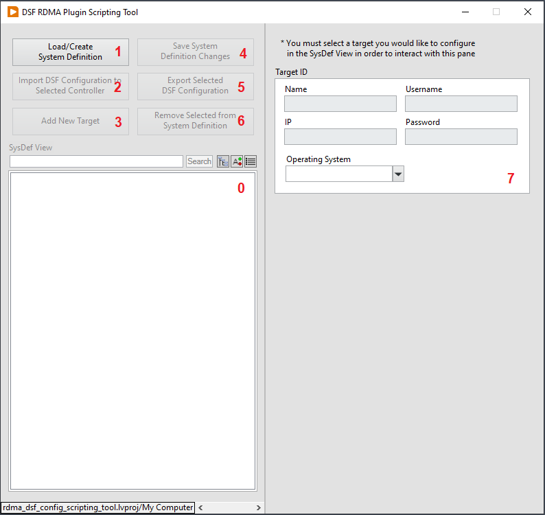
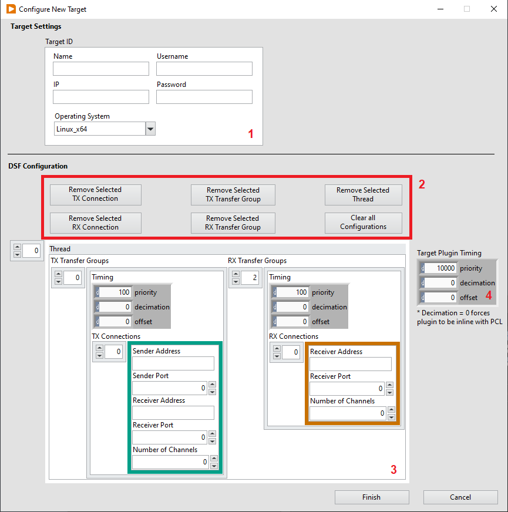

# RDMA DSF Plugin Scripting Tool Tutorial

## About
### This scripting tool simplifies the process of configuring the DSF within a VeriStand System Definition. The tool can be used to modify existing VeriStand System Definition Files and to create new VeriStand System Definition Files.

### **NOTE**: This document assumes knowledge of the RDMA API. If you want to learn more about how the RDMA uses this info please refer to the LabVIEW RDMA driver.

#

## The Front Panel

### 0) SysDef View
- Provides a preview of the system definition as it would appear in the VeriStand System Explorer.

### 1) Load/Create System Definition File Button
- Spawns file dialog to select the system definition file that you would like to load. If you specify a path to a non-existent system definition file, the file will be created for you.

### 2) Import DSF Button
- This enables you to import an existing DSF configuration file to the target selected in SysDef View. - **NOTE**: the DSF configuration file can either be a .json or .dsf file.

### 3) Add New Target Button
- Launches dialog to create and configure a new target. (discussed further below)

### 4) Save System Definition Button
- Saves the changes made using this tool to your system definition file. No changes are ever saved without pressing this button.

### 5) Export Button
- Enables you to export the configuration of the DSF node that is selected in SysDef View.

### 6) Remove from System Definition
- Removes the node selected in SysDef View from the system definition.

### 7) Target ID Control
- Provides basic identifying information for a target selected in the SysDef Viewer.

#

## New Target Configuration Dialog

Pressing the "Add New Target" button on the front panel will launch the target configuration dialog. Below is a description of all the controls in that window.

### 1) Target ID
- This cluster control is identical to the indicator seen on the front panel of the scripting tool. Use these settings to configure the identity of the target you are wishing to configure. Further configuration of the target must be accomplished through the VeriStand System Defintion explorer after saving your system defintion.

### 2) DSF Configuration Clearing Buttons
- These buttons can be used to clear the DSF configuration or delete certain parts of it in the case that information is accidentally added. Using these buttons to remove accidentally added data will prevent you from needing to restart the configuration due to a mistake.

### 3) DSF Configuration
- Used to configure the DSF RDMA plugin on the new target. 

- Threads: Each element in the top level array represents a single DSF thread. **NOTE**: We have experienced very jittery and poor latency performance when using multiple threads, but have not yet found a need for multiple threads. 
    - TX Transfer groups: Represents DSF TX transfer groups
        - Timing: Used to configure the timing for the transfers contained within each transfer group. **NOTE**: leave offset at 0 to have a transfer group execute in line with the PCL.
        - TX Connections: Represents DSF transfers, each containg information needed to configure individual TX endpoints
            - Sender Address: ip address of the RT target trasmitting data
            - Sender Port: port at which data is being trasmitted
            - Receiver Address: ip address of the RT target receiving data
            - Receiver Port: port at which data is being received
            - Number of Channels: number of TX channels to create
    - RX Transfer groups: Represents DSF TX transfer groups
        - Timing: Used to configure the timing for the transfers contained within each transfer group. **NOTE**: leave offset at 0 to have a transfer group execute in line with the PCL.
        - RX Connections: Represents DSF transfers, each containg information needed to configure individual RX endpoints
            - Receiver Address: ip address of the RT target receiving data
            - Receiver Port: port at which data is being received
            - Number of Channels: number of RX channels to create

### 4) Target Plugin Timing
- This control configures plugin-level DSF timing properties. **NOTE**: leave offset at 0 to have the plugin execute in line with the PCL.

#

## How to use
1. (Not required, but recommended) Create a VeriStand Project that uses the system definition file that you would like to configure. 
2. Make sure the System Definition Explorer is closed.
3. Load the System Definition file into the scripting tool, configure the system definition using the tool, and save your changes to the System Definition File.
4. (Optional) Open the configured System Definition File in VeriStand System Explorer to verify that everything is configured properly. You will probably want to avoid this step when possible, as the System Explorer becomes extremely slow when it contains DSF nodes.
5. Deploy your project in VeriStand.